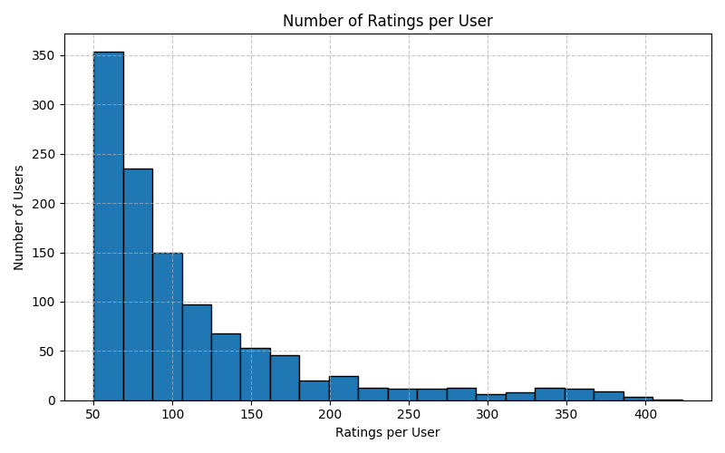
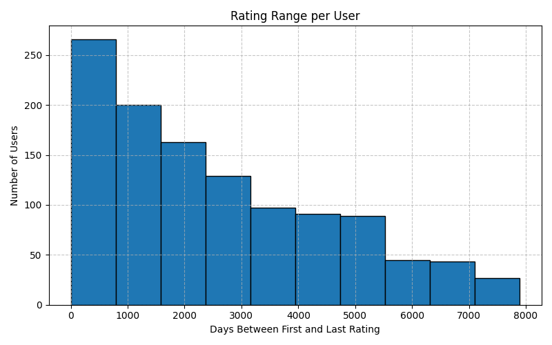
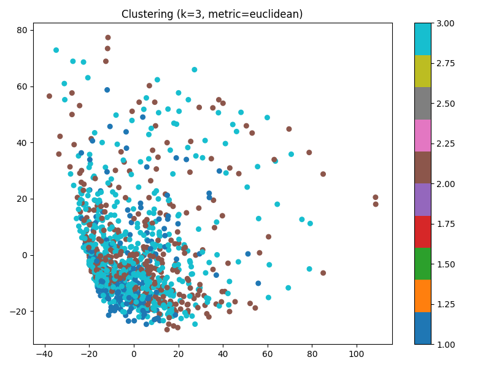
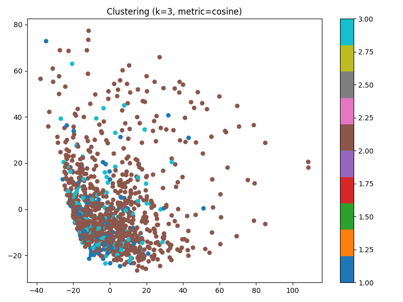
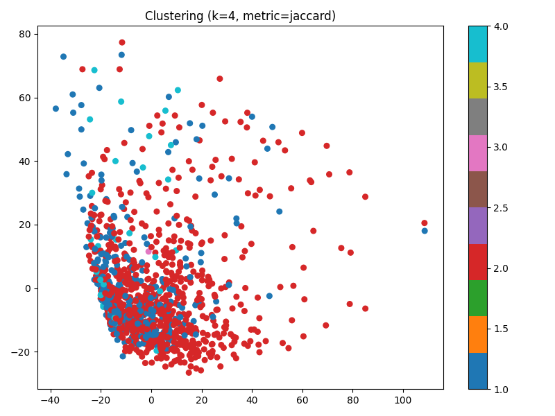
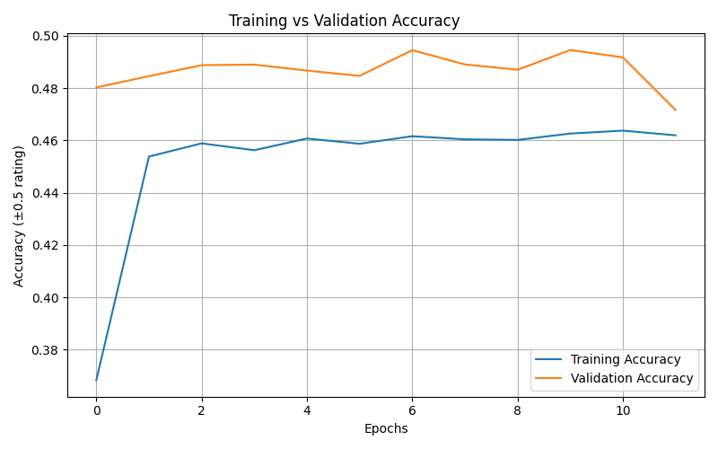
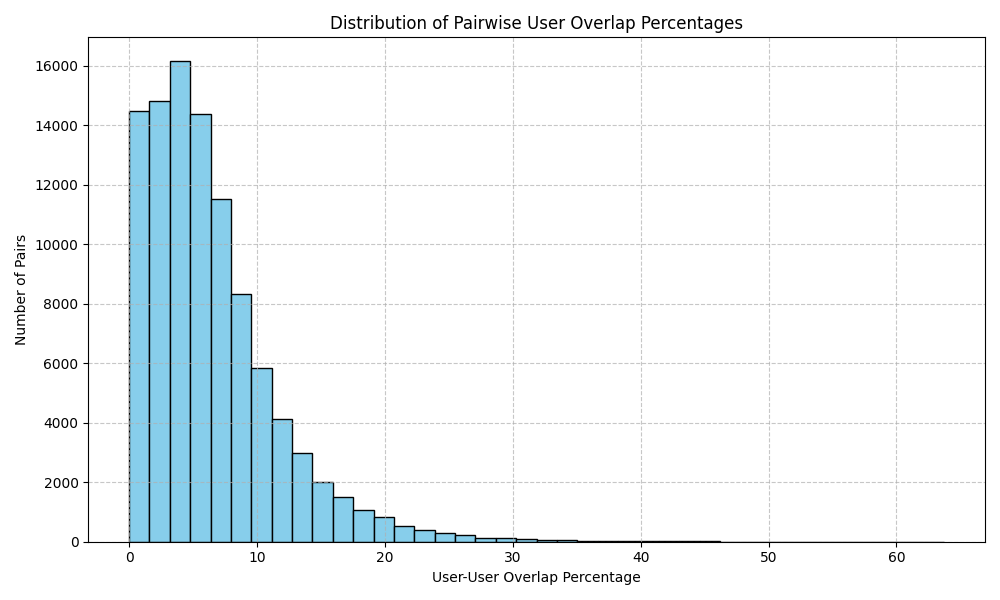

# 🎬 Movie Recommender System – MPPL2327

**Author**: Sarandidis Romanos
**Course**: Pattern Recognition
**University**: University of Piraeus
**Year**: 2025

This project builds a movie recommendation system that combines clustering algorithms with neural networks to group users based on their preferences and generate personalized movie recommendations.

---

## 📁 Project Structure

```plaintext
.
├── Dataset/                         # Raw dataset of movie reviews
├── ModifiedData/                    # Processed data files
├── Prediction/                      # Generated results (metrics, plots)
├── Final/                           # Executables
    ├── computational_assignment.py  # Main execution script
    ├── setup.py                     # Dataset download and setup
    ├── user_matrix.py               # Preprocessing and matrix construction
    ├── histogramms.py               # User activity histogram analysis
    ├── KMeans.py                    # Custom k-means clustering logic
    ├── nearest_neighbors.py         # k-NN computation per user
    ├── network.py                   # Training neural networks
└── README.md                        # Documentation
```

---

## 🧠 System Capabilities

### 1. Data Preprocessing

* Extracts user and movie identifiers.
* Filters users by rating count and removes rarely rated movies.
* Constructs a **sparse user-movie matrix**.

📁 Outputs:

* `ModifiedData/user_matrix.csv`
* `ModifiedData/users.csv`
* `ModifiedData/movies.csv`

---

### 2. User Behavior Visualization

📊 **Histograms** (from `histogramms.py`):

* **Ratings per User**
  Most users provided 1 rating making them unqualified for valid assumptions. The suggested datagroup is in the range of 50 to 400 ratings/user.

* **Time Range of Reviews per User**
  Time span ranges up to 15 years between first and last review across the users.

📷 *Example Chart:*



---

### 3. User Clustering via K-Means

📌 **Distance Metrics Supported**:

* **Euclidean Distance**
* **Cosine Similarity**
* **Jaccard Distance** (based on shared rated movies)

📷 *Cluster Visualizations via PCA*:




📉 *Silhouette Scores (Sample Results)*:

| Metric    | Best k | Silhouette Score |
| --------- | ------ | ---------------- |
| Euclidean | 3      | -0.0025          |
| Cosine    | 3      | -0.0419          |
| Jaccard   | 2      | **0.1493** ✅     |

📦 Output:

* `ModifiedData/clusters.csv`
* `Prediction/distances.csv`

---

### 4. Nearest Neighbor Mapping

For each user within a cluster, the system computes their **k=6 closest neighbors**, using Jaccard-based user distance.


---

### 5. Neural Network Recommendation System

🧠 Each cluster is assigned a dedicated **feedforward neural network** trained to predict user ratings based on their neighbors' ratings.

🏗️ Model Structure:

* Input: k=6 ratings from neighbors
* Hidden Layers: 128 → 64 → 32 (ReLU)
* Output: Single rating prediction (scaled \[0–10])
* Loss: Mean Squared Error (MSE)
* Optimizer: Adam

📈 *Training Visualization*:




📊 *Evaluation Metrics Summary*:

| Cluster   | MAE (Train) | MAE (Test) | Accuracy (Test) |
| --------- | ----------- | ---------- | --------------- |
| Cluster 1 | 1.5370      | 1.5661     | 41.07%          |
| Cluster 2 | 1.5302      | 1.5333     | 40.47%          |
| Cluster 3 | 1.5805      | 1.5805     | 40.42%          |

💡 **Insights**:

* Accuracy remains low due to **high data sparsity (\~80% zeros)**.
* **Jaccard clustering** performed slightly better, yet NN predictions remained limited.
* Even after clustering, average user overlap remains under **10%**, figure below.

📈 *Sparcity Visualization*:




---

## 🚀 How to Run

1. **Install dependencies**:

```bash
pip install pandas numpy matplotlib scikit-learn tensorflow
```

2. **Run the program**:

```bash
python computational_assignment.py
```

3. **Interactive Menu**:

```text
=== Movie Recommender System ===
1. Build user-movie matrix
2. Create histograms
3. Run KMeans clustering
4. Generate nearest neighbors
5. Train and evaluate neural network
6. Exit
```

---

## ⚠ Limitations

* **Data Sparsity**: Most users only rate a fraction of available movies.
* **Weak Overlap**: Low shared preferences between users impact NN learning.
* **Poor Separation**: Clustering metrics show negative silhouette scores.

---

## 🧪 Future Improvements

* Incorporate **implicit feedback** (e.g., clicks, views).
* Apply **matrix factorization** techniques for denser latent embeddings.
* Add **temporal modeling** for evolving user preferences.


